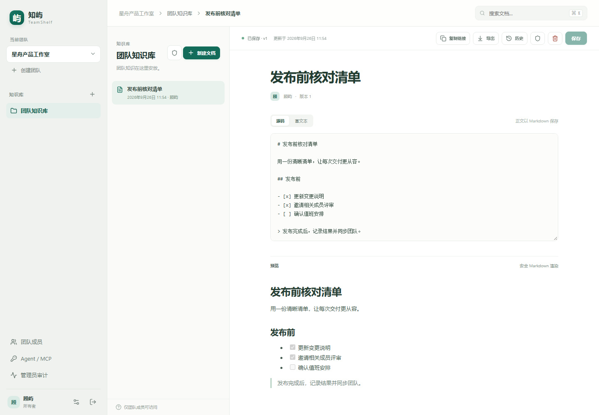
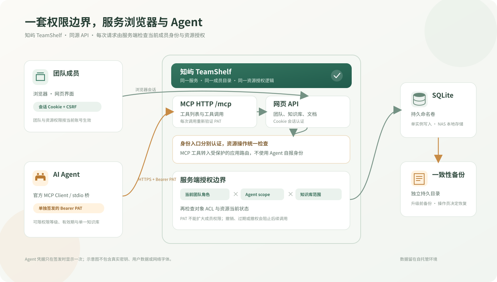
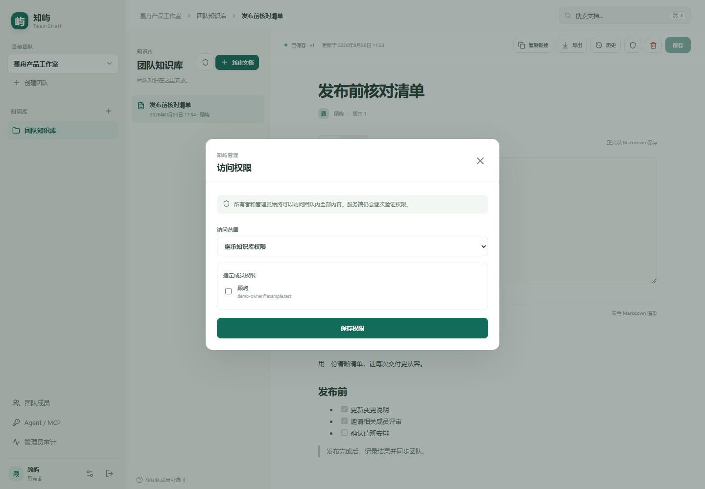
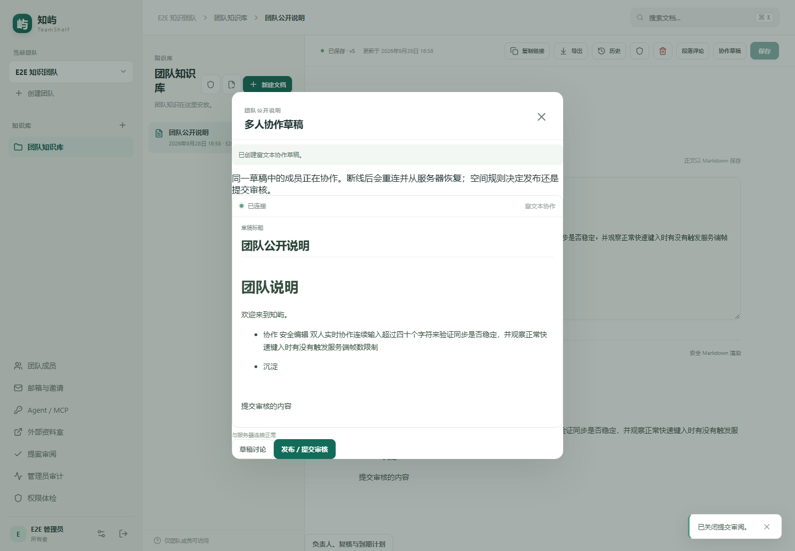
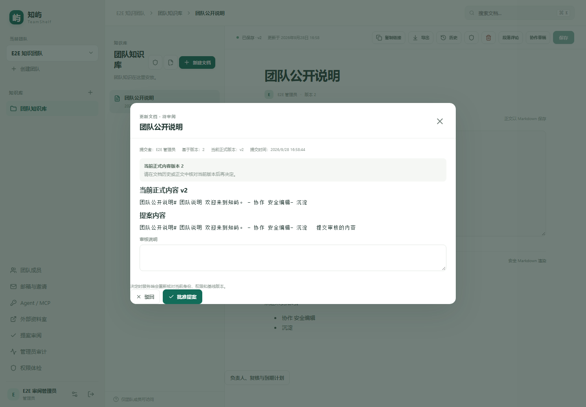
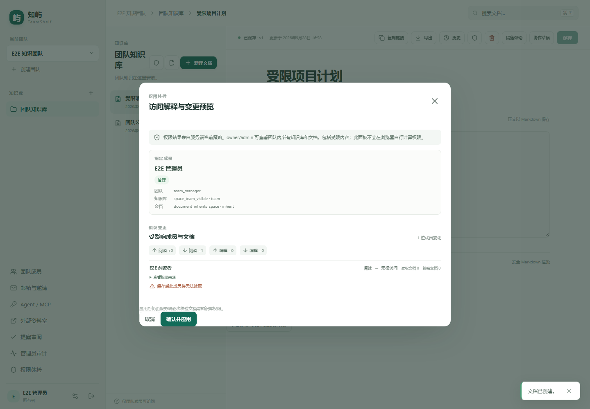

# 知屿 TeamShelf

把团队文档放在自己的 NAS 或服务器上，成员通过网页查看和编辑。正文以 Markdown 保存，支持源码和富文本编辑，并按团队、知识库和文档管理访问权限。

[](docs/images/teamshelf-editor-demo.png)

*演示截图使用隔离数据库和虚构团队数据。页面展示 Markdown 编辑与预览；下方图示说明网页用户与 Agent 共用同一套服务端权限。*



## 选择运行方式

| 方式 | 适合谁 | 从这里开始 |
| --- | --- | --- |
| NAS / Docker 源码部署 | 想把服务和数据运行在自己的 NAS 或 Linux 服务器上 | [按步骤安装](#nas--docker-源码部署) |
| Windows 本机体验 | 想先在自己的 Windows 电脑试用 | [本机启动](#windows-本机体验) |
| NAS 固定 digest 更新 | 已运行 TeamShelf，按已验证版本更新 | 阅读 [`nas-up.sh` 部署说明](docs/DEPLOYMENT.md#nas-固定-digest-安装与更新) |
| GitHub 自动更新 | 管理员已配置 NAS runner，想通过 GitHub 校验并部署 | 阅读 [`deploy-release.ps1` 与 CI/CD 说明](docs/CICD.md) |

## NAS / Docker 源码部署

下方命令是 Linux/NAS 示例，部署者需要 Docker Engine、Docker Compose v2 和 Bash。Windows 部署者可用 Docker Desktop Linux 容器及 [Git for Windows Bash](https://git-scm.com/install/windows)，并按[Windows Docker Compose 步骤](docs/DEPLOYMENT.md#源码-docker-compose)使用 Windows 路径。团队成员无需安装这些工具，只需浏览器。

1. 获取项目源码。若尚未下载且有仓库访问权限，可克隆仓库；若已克隆或已解压源码，跳过克隆。无论来源如何，后续命令都要在包含 `README.md` 和 `compose.yaml` 的项目根目录运行。

```sh
git clone https://github.com/Zhao-zixi/team-docs.git
cd team-docs
```

2. 将下面的 `192.168.1.20` 换成 NAS 在团队局域网中的实际 IP，并将 `/srv/teamshelf-backups` 换成 NAS 上持久且位于项目目录之外的备份目录。`teamshelf` 项目名和 `teamshelf-data` 卷名请在首次部署后保持不变。

```sh
bash deploy/source-up.sh \
  --project teamshelf \
  --volume teamshelf-data \
  --backup-dir /srv/teamshelf-backups \
  --origin http://192.168.1.20:8080 \
  --port 8080 \
  --cookie-secure false \
  --init-volume
```

3. 首次启动后，在浏览器打开 `http://192.168.1.20:8080` 并完成下方初始设置。这个 HTTP 示例适合可信局域网测试；公开网络请配置 HTTPS，详见[部署指南](docs/DEPLOYMENT.md)。

后续更新时，先在项目根目录获取新源码：Git 克隆方式使用 `git pull --ff-only`；若使用下载包，则下载新版并按[部署指南](docs/DEPLOYMENT.md)保留本地 `.env` 和数据卷。然后重复上面的启动命令，但去掉 `--init-volume`。不要更换项目名、卷名或删除数据卷。

## Windows 本机体验

仅部署者需要安装 [PowerShell 7](https://learn.microsoft.com/en-us/powershell/scripting/install/install-powershell-on-windows?view=powershell-7.6) 和 [Node.js 24 LTS](https://nodejs.org/en/download)；团队成员只需浏览器。获取或解压项目后，在包含 `README.md` 的项目根目录运行：

```powershell
pwsh -NoProfile -File .\scripts\start-local.ps1
```

新配置默认打开 `http://localhost:8080`，仅供这台电脑本机体验。若要让其他成员访问，需将 `.env` 中的 `APP_ORIGIN` 配置为他们可访问的地址；参见[部署指南](docs/DEPLOYMENT.md)。保持启动终端运行，按 `Ctrl+C` 停止。

## 首次设置

1. 在网页初始化页面输入项目根目录 `.env` 文件中的 `SETUP_TOKEN`。本机和 NAS 的配置都在各自项目根目录；只在网页输入，不要发给团队成员或贴入命令、截图和日志。
2. 按提示设置管理员姓名、邮箱和网页登录密码。密码由你自行创建，与 `SETUP_TOKEN` 不同。
3. 初始化完成后用邮箱和密码登录，再邀请团队成员并分配角色。

## 权限与数据



owner/admin 可以查看本团队全部知识库和文档，包括受限内容。管理员角色管理另有边界：只有 owner 可以任命或撤销 admin。普通成员按团队角色和资源授权访问；受限知识库需要知识库授权，受限文档还需要文档授权，文档授权不能绕过所属知识库权限。Agent 凭据也受当前成员权限与凭据范围共同限制，详见[架构与权限](docs/ARCHITECTURE.md)和[Agent / MCP 指南](docs/MCP.md)。管理员个人邮箱配置、邮件邀请和重发方式见[邮箱与邀请指南](docs/EMAIL.md)。

SQLite 数据默认位于本机 `DATA_DIR` 或 Docker 持久命名卷。不要把活动数据库放在 SMB/NFS 共享目录，也不要同时运行多个写入实例。更新前做好备份；部署脚本在更新过程中创建一致性备份。备份和恢复步骤见[部署指南](docs/DEPLOYMENT.md)。

## 邮箱与邀请

团队管理员可在“邮箱与邀请”中配置自己的 SMTP 发信邮箱，测试邮件只会发送到自己的登录邮箱。成员邀请默认通过邮件发送；也可单独生成手动链接，该操作不会发送邮件或验证邮箱。配置与故障处理见[邮箱与邀请指南](docs/EMAIL.md)。新账号和修改密码要求密码至少 8 个 Unicode 字符（最多 128 个）；常见弱密码仍会被拒绝。

## 协作、审阅与资料室



*演示使用隔离数据库和虚构团队数据。协作草稿与正式文档分开；正式正文只在发布或提案获批后更新。*

多人可在 Markdown 或富文本协作草稿中同步编辑，并使用段落评论、回复和 @ 提醒讨论。启用知识库审阅后，新建、修改、恢复和删除会先成为提案；作者可以查看或撤回自己的提案，另一位管理员核对前后差异后批准或驳回。版本冲突时，草稿保留，作者先查看正式版与草稿差异，再明确确认新基线。

文档还可设置负责人、复核和到期时间；管理员能查看服务端计算的权限解释、变更影响预览与团队权限体检。外部资料室只展示管理员选定的正式版本快照，可设口令和有效期，并可撤销及查看访问记录。






完整功能边界、部署 WebSocket 反向代理和提醒说明见[协作与审阅指南](docs/COLLABORATION.md)。

## 开发者进阶

Windows 开发环境需要 [PowerShell 7](https://learn.microsoft.com/en-us/powershell/scripting/install/install-powershell-on-windows?view=powershell-7.6)、[Node.js 24 LTS](https://nodejs.org/en/download) 和 npm。在项目根目录运行：

```powershell
pwsh -NoProfile -File .\scripts\start-dev.ps1
```

网页默认地址为 `http://localhost:5173`。开发服务与生产服务不要同时使用同一数据目录。接口、测试、固定 digest 部署和 GitHub 自动更新细节分别见[API 契约](docs/API.md)、[测试说明](docs/TESTING.md)、[部署指南](docs/DEPLOYMENT.md)和[CI/CD 指南](docs/CICD.md)。
