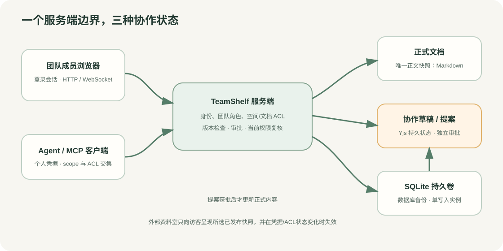

# 协作、审阅与外部资料室

TeamShelf 将多人工作拆成正式文档与可变更草稿。浏览器与 MCP Agent 使用成员账号通过服务端身份认证；两者均受成员角色、空间/文档 ACL 与版本检查约束；协作草稿不直接改写正式 Markdown。



## 功能入口

| 功能 | 网页入口 | 作用 |
| --- | --- | --- |
| 实时协作 | 打开可编辑文档 →「协作草稿」 | 选择 Markdown 源码或富文本模式创建固定模式的草稿；两人可同时编辑、查看协作者光标，并在草稿中讨论。 |
| 提案审阅 | 左侧「提案审阅」；知识库菜单「审阅规则」 | 管理员可启用审阅；作者查看/撤回自己的提案，其他管理员查看差异并批准或驳回。 |
| 文档计划 | 打开文档 →「负责人、复核与到期」 | 设置负责人、复核/到期时间，并按权限标记已复核。 |
| 权限解释与体检 | 访问权限 →「解释与预览」；团队管理 →「权限体检」 | 预览当前成员的服务端有效权限和拟议变更影响，再显式应用；体检展示团队计数与授权问题。 |
| 外部资料室 | 团队管理 →「外部资料室」 | 选择已发布文档版本、设置到期和口令，生成一次性链接；管理访问记录、刷新快照、轮换或撤销。 |

## 协作草稿与正式发布

创建草稿时必须选择 Markdown 或富文本模式；模式固定到该草稿。Markdown 使用协作文本，保留源文件语法；富文本使用受支持的 ProseMirror 文档结构，并通过 Markdown 无损投影检查。富文本无法无损表示的结构不能发布。草稿评论通过「草稿讨论」进入，只有当前可编辑的成员可以读取或写入草稿讨论；送审冻结草稿后，应在提案上继续审阅讨论。

草稿通过同源、会话 Cookie 鉴权的 WebSocket 同步。服务端按当前会话验证每次更新和权限；权限撤销、登出或送审会关闭对应协作连接。浏览器不使用跨标签 BroadcastChannel 或 IndexedDB 离线副本。断线后客户端可重连并从服务端持久化状态同步；界面在服务端不同步或连接未就绪时不允许提交。

未启用审阅的空间中，草稿经版本与同步校验后可发布为正式 Markdown。启用审阅后，新建、更新、恢复和删除都生成独立提案，正式内容在其他管理员批准前保持不变。作者不能批准自己的提案；作者可查看并撤回自己的待审提案。提案详情展示正式内容与拟议内容的前后差异，长差异会截断展示。

若正式文档在草稿期间更新，发布/送审会发生版本冲突。系统保留协作草稿；用户需查看当前正式版本与草稿差异，再明确选择“以版本 N 为新基线，保留当前草稿”。此操作只更改草稿基线，不覆盖草稿正文。若仍有待审提案，必须先等提案结束或撤回，再重新确认基线。

## 评论、工作流与提醒

正式文档可选中一段文字发起评论、回复、@当前可协作成员，并解决或重新打开话题。评论固定记录其来源版本/草稿序号与段落偏移；正文改变后，旧引用标为过期供参考，不自动移动。公开资料室不显示评论或内部协作信息。

文档计划可设置负责人、下次复核和到期时间。团队设置提醒发件人后，计划可触发邮件提醒；未配置发件人时仅保留站内待办，不发送邮件。提醒由 outbox 异步投递，系统提供至少一次投递语义；网络错误或进程中断可能造成重复投递，不能按 exactly-once 处理。邮件失败可由管理员检查发件设置和 outbox 状态后处理。

## 权限解释与影响预览

权限解释、变更影响与团队体检来自服务端实时权限计算，浏览器不自行推算最终 ACL。修改空间或文档权限时，先选择成员查看解释与拟议变更影响，再由有管理权限的用户明确确认应用。owner/admin 可查看团队内全部知识库和文档，包括受限内容；成员角色管理仍有额外限制，只有 owner 可任命或撤销 admin。普通成员对受限空间需要空间授权；受限文档还要求文档授权，文档授权不能越过空间边界。

## 外部资料室

资料室固定展示创建时选择的正式版本快照，不会随文档后续编辑自动变化。管理员可以显式刷新某个条目到新的已发布版本、移除条目、轮换访问链接或撤销整个资料室，并查看访问记录。原始访问 URL 只在创建或轮换时显示一次；服务器只保存凭据摘要，遗失后需轮换。访客需输入资料室口令，公开页面只显示所选文档标题和正文，不展示团队、知识库、成员、作者、版本历史或搜索功能。

创建者访问资格失效，或文档/空间 ACL 策略或授权发生任何变化（无论扩大还是收紧），相关资料室条目都会失效；资料室/条目被撤销、移除、过期或口令更改后，访客后续请求也会被拒绝。系统不会把资料室变成绕过当前访问资格的永久公开副本。不要将口令或完整访问 URL 放进日志、分析事件或公开截图。

## WebSocket 反向代理

协作通道使用与网页同源的 `/api/collaboration/:draftId` WebSocket。反向代理必须转发 Upgrade 和 Connection 请求头，并保留 HTTP/1.1 隧道；例如 Nginx：

```nginx
location / {
    proxy_pass http://127.0.0.1:8080;
    proxy_http_version 1.1;
    proxy_set_header Host $host;
    proxy_set_header X-Forwarded-Proto $scheme;
    proxy_set_header Upgrade $http_upgrade;
    proxy_set_header Connection "upgrade";
    proxy_read_timeout 3600s;
}
```

将上游地址替换为 TeamShelf 实际监听地址。若在 Nginx 配置中使用 `map` 动态生成 Connection 值，`map` 必须放在 `http` 配置作用域；上面的最小示例直接为 WebSocket 路径设置 upgrade。外部 origin 必须与 `APP_ORIGIN` 精确一致，生产环境使用 HTTPS 并设置安全 Cookie。Vite 开发代理也启用 WebSocket 转发。

## 数据和运维边界

正式正文的唯一业务快照仍是 Markdown；草稿 Yjs 状态与审批提案独立持久化。定期备份 SQLite，并将 SMTP 加密主密钥与数据库备份一并保护；迁移恢复要求参见[邮箱与邀请指南](EMAIL.md)和[部署指南](DEPLOYMENT.md)。应用保持单写入实例，不要将活动 SQLite 放到 SMB/NFS 共享目录。
