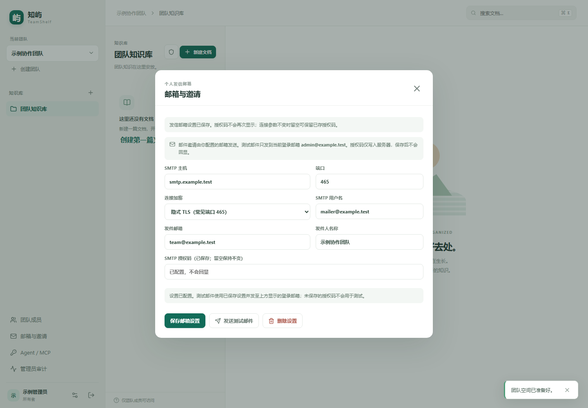

# 邮箱与邀请

*截图使用隔离数据和虚构邮箱，仅展示配置界面，不代表已连接真实邮件服务。*

## 配置个人发信邮箱

团队当前的 owner 或 admin 登录后，在左侧选择“邮箱与邀请”。账号使用邮箱地址作为登录名，无需另设用户名。SMTP 设置属于当前管理员账号，不会成为全团队共享凭据。

填写邮箱服务商提供的 SMTP 主机、端口、连接加密方式、用户名、发件地址和发件人名称。选择与服务商要求一致的连接方式：隐式 TLS 或 STARTTLS。通常需要使用邮箱服务商单独签发的 SMTP 授权码，而不是网页登录密码。

授权码只在输入时显示。保存后服务端只返回“已配置”状态，不会再次回显密钥。修改发件地址或发件人名称等非连接设置时，可将授权码留空以保留原值。若更改 SMTP 主机、端口、加密方式或用户名，必须重新输入授权码。删除设置会移除当前账号的 SMTP 配置。Linux 部署会把 DATA_DIR/mail-encryption.key 作为持久卷中的 0600 主密钥；备份或迁移 SMTP 配置时，SQLite 数据和该密钥必须一起保留。Windows 依赖 DATA_DIR 的私有 NTFS ACL。若密钥文件缺失而 SQLite 中仍有任意 SMTP 配置，邮件发送和密钥初始化都会 fail closed。优先从备份恢复原密钥；若原密钥无法恢复，必须先删除所有失效的个人 SMTP 配置，再逐一重新配置。只删除其中一个账号的配置不足以生成新密钥。现有邀请仍可接受，但没有可用发信配置时不能发送或重发邮件。

点击“发送测试邮件”会向当前登录账号的邮箱发送测试邮件，页面会显示发送成功或错误状态。请先确认账号邮箱可收件。测试邮件可能受到服务商限流或垃圾邮件策略影响。

## 邮件邀请与手动链接

在“团队成员”中填写受邀邮箱和角色后，使用“邮件邀请”创建邀请并发送邮件。只有 owner 可以邀请 admin；admin 可邀请 editor 和 viewer。邀请列表会显示邮件发送状态。发送失败时，邀请记录仍保留，可检查发信配置后点击“重发邮件”。重发会轮换邀请密钥，因此先前邮件中的链接会失效；请受邀者使用最新邮件。

若需通过其他渠道转发，可明确选择“生成手动链接”。手动链接不会发送邮件，也不表示邮箱已验证。创建后，链接只在当前对话框内展示一次，请安全转发；关闭对话框后页面不保留该链接。邀请仍须由受邀者打开并按页面提示接受。

接受邀请时，已有账号使用原密码；新成员输入姓名和新密码。已有账号密码不会因为邀请而重置。管理员应撤销不再需要的邀请。

## 密码要求

新建管理员账号、新受邀成员账号及修改密码要求密码至少 8 个 Unicode 字符，最多 128 个 Unicode 字符；可以使用空格和 Unicode 字符。常见弱口令也会被拒绝。建议使用唯一且难以猜测的密码。已有账号登录及接受邀请时继续使用原密码，以保持旧账号兼容。

SMTP 密钥和网页登录密码不要放入截图、聊天、代码仓库或命令行参数。排查问题时只分享去除收件人个人信息和认证内容的错误信息。
