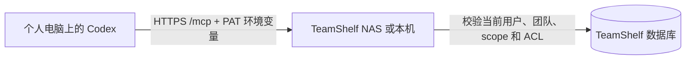

# Agent 与 MCP 设计

## 身份与凭据

MCP 使用 stateless HTTP endpoint `/mcp` 和官方 TypeScript MCP server v2.1.0 协议实现。客户端通过 `Authorization: Bearer ts_agent_…` 认证。MCP 请求不得使用浏览器 session cookie，也拒绝 Bearer 与 cookie 混合认证。若请求带 Origin，必须精确匹配 `APP_ORIGIN`；Host 仅允许配置源 hostname 或 loopback。MCP 不需要浏览器 CSRF header。

PAT 固定绑定一个用户、一个团队、一个 scope 和可选的单空间。数据库只保存 token hash、提示信息和元数据；随机 token 只在创建响应中展示一次。默认 scope 为 `read`，默认 30 天，最多 90 天。scope 不得高于签发人当前团队角色（viewer=read、editor=write、admin/owner=manage）。space-bound token 创建时必须可读该空间，此后每次调用都重新验证当前成员身份、空间存在性和 ACL。成员移除、密码更改和备份恢复会撤销该用户的 PAT。空间限定 token 永不提升为全团队 token。

凭据管理 REST API 只接受 session cookie + CSRF。用户可查看和撤销自己的凭据。owner 可查看、撤销团队所有凭据；admin 可查看团队元数据并撤销自己的以及 editor/viewer 的凭据，不能撤销 owner 或其他 admin 的凭据。已移除用户的凭据保留撤销元数据供审计。

## 工具边界

所有工具名称和 schema 固定，禁止传入任意 URL、HTTP method 或自报 actor。userId 仅能作为固定工具中被授予 ACL 或被管理的成员标识，服务端会校验其团队成员身份与操作权限。路由必须由显式 route-config 白名单标记允许的 Bearer scope；未标记路由默认拒绝 Bearer。每次调用经 Fastify `app.inject` 复用 REST handler，真实用户/团队/空间来源于已校验 PAT 和数据库，仍由既有 ACL 作资源判定。写操作继续要求版本号 CAS。MCP 工具错误使用 MCP `CallToolResult` 的 `isError` 表示；成功结果使用结构化内容或文本内容。

只读工具（scope `read`）：

- `whoami {}`：返回当前用户与固定团队身份，不列出其他团队。
- `list_spaces {offset?,limit?}`、`list_documents {spaceId,offset?,limit?}`、`search_documents {query,spaceId?,offset?,limit?}`。
- `get_document {documentId}`、`get_revisions {documentId,offset?,limit?}`（只返回版本元数据）、`get_revision {documentId,revisionId}`（仅指定版本返回正文）、`export_document {documentId}`。列表工具支持 `offset` 与 `limit`，limit 最大 100；空间范围搜索使用 `spaceId` 在服务端过滤。

`write` 另允许 `create_document {spaceId,title,markdown?}` 与 `update_document {documentId,title,markdown,version}`。创建文档固定继承空间 ACL；只有 `manage` 可通过独立 ACL 工具修改访问范围。

`manage` 另允许 `create_space {name,description?}`、`update_space {spaceId,name?,description?}`、`delete_space {spaceId}`、`set_space_access {spaceId,visibility,grants}`、`set_document_access {documentId,visibility,grants}`、`delete_document {documentId}`、`restore_document {documentId,revisionId,version}`、`rename_team {name}`、`list_members {offset?,limit?}`、`change_member_role {userId,role}`、`remove_member {userId}`、`list_invitations {offset?,limit?}`、`invite_member {email,role}`、`cancel_invitation {invitationId}`、`list_audit {offset?,limit?}`。space-bound token 禁止团队级操作。

## 存储升级

现有 v1 SQLite schema 没有迁移框架。新增凭据表时使用显式幂等迁移，兼容 `user_version=1` 数据库并升级至 v2；恢复旧备份后下次正常启动完成迁移，再撤销所有 PAT，防止旧快照复活凭据。PAT 外键不使用“空间删除后置空”语义；空间限定凭据必须保留原 spaceId 并失效/撤销，绝不能扩权。

## 审计与安全验证

调用审计保存真实 userId、credentialId、工具/操作、目标资源和结果状态，不记录 Bearer token、正文或原始邀请 token。使用官方 MCP client 通过真实 HTTP endpoint 验证协议握手和工具调用；至少覆盖默认兼容握手与自动协商新协议。工具测试还需验证 scope、团队、空间、实时 ACL、撤销、CSRF、混合凭据拒绝以及凭据恢复迁移。
## 在知屿界面签发凭据

登录后打开侧栏的“Agent / MCP”。创建凭据时选择当前团队、权限 scope、有效期（默认 30 天，最长 90 天）及可选的单个知识库。只为 Agent 选择完成工作所需的最低权限。凭据创建成功后，完整 PAT 只显示这一次；关闭弹窗、切换团队或退出登录后页面立即清除明文。请当场复制到客户端的秘密管理配置中。凭据列表只显示名称、前后缀提示、权限范围、知识库、有效期、最近使用和撤销状态，不会再次显示 token。

用户只能为自己创建凭据。owner/admin 可在“团队凭据”视图管理团队元数据和撤销权限范围内可撤销的 PAT，但任何人都不能读取其他凭据的明文。撤销后，已连接的客户端下一次 MCP 请求会立刻失效。用户仍受当前团队角色和 ACL 约束；有效权限取 PAT scope 与用户当前角色权限的交集。管理员通过自己的凭据仍拥有其既有团队管理权限，所以不要把管理员 PAT 当作只读凭据交给 Agent。

PAT 不是 OAuth 登录，也不是浏览器会话。单空间 PAT 只可操作绑定知识库；即使 scope 为 manage，也不能执行团队级成员、邀请、团队改名和审计操作。密码更改、成员离队、凭据过期或撤销、删除绑定空间都会使 PAT 失效。备份恢复会撤销凭据，避免旧快照重新激活已撤销 token。

## 个人电脑使用 Codex 连接 TeamShelf

推荐 Codex 直接使用 TeamShelf 的 Streamable HTTP endpoint。TeamShelf 只接收 `Authorization: Bearer` PAT，不使用浏览器 cookie；PAT 会受创建者当前团队角色、凭据 scope 和知识库 ACL 的共同限制。



1. 在 TeamShelf 网页侧栏打开“Agent / MCP”，创建仅供自己使用的 PAT。初次连接建议选 `read` scope、默认 30 天有效期，并绑定到所需知识库；不需要整队读取时不要选全团队范围。完整 PAT 只显示一次，复制到本机的秘密管理器。不要把 PAT 放入 URL、`config.toml`、shell 配置文件、代码、命令参数、截图或日志。
2. 在 Codex 用户级 `config.toml` 添加服务器配置。Windows 默认位置为 `%USERPROFILE%\.codex\config.toml`；macOS/Linux 默认位置为 `~/.codex/config.toml`。示例仅保存 endpoint 和环境变量名，不含 token：

```toml
[mcp_servers.teamshelf]
url = "https://docs.example.net/mcp"
bearer_token_env_var = "TEAMSHELF_MCP_TOKEN"
enabled_tools = ["whoami", "list_spaces", "list_documents", "search_documents", "get_document"]
```

`docs.example.net` 要替换成用户实际访问 TeamShelf 的 HTTPS 主机名，保留末尾 `/mcp`。服务端 `APP_ORIGIN` 必须配置为相同主机；不要把 PAT 放在 URL 中。若 Codex 与本机 TeamShelf 服务运行于同一台电脑，也可用 `http://127.0.0.1:8080/mcp`（或该服务实际端口）；远程连接 NAS 时使用带有效证书的 HTTPS 地址。

3. 在启动 Codex 的进程环境中临时设置 `TEAMSHELF_MCP_TOKEN`，再从同一终端启动 Codex CLI。PowerShell 7 可用安全输入提示，不会回显输入：

```powershell
$secure = Read-Host '输入一次性显示的 TeamShelf PAT' -AsSecureString
$env:TEAMSHELF_MCP_TOKEN = [System.Net.NetworkCredential]::new('', $secure).Password
codex mcp list
codex
Remove-Item Env:TEAMSHELF_MCP_TOKEN
Remove-Variable secure
```

macOS/Linux 的 Bash 或 Zsh 可从不回显的提示设置当前 shell 变量：

```sh
read -rsp 'TeamShelf PAT: ' TEAMSHELF_MCP_TOKEN; printf '\n'
export TEAMSHELF_MCP_TOKEN
codex mcp list
codex
unset TEAMSHELF_MCP_TOKEN
```

这些例子只在当前终端会话中保留变量；环境变量仍会以明文提供给 Codex 子进程，因此只在可信个人电脑上使用，并在结束后清除。不要用 `setx`、shell profile、共享 `.env` 或项目级 `.codex/config.toml` 保存 PAT。若希望从系统密码管理器注入变量，请确保它注入到启动 Codex 的进程环境；macOS 从 Dock/Finder 已运行的 Codex 不一定继承终端变量。Codex 桌面版、CLI 与 IDE 扩展共享用户级 MCP 配置；配置或环境变量变化后重启客户端。

4. `codex mcp list` 应显示 `teamshelf` 已启用。启动 Codex 后先让它调用只读 `whoami`，再调用 `list_spaces`；确认返回的是预期团队和可访问知识库。可要求 Codex 只读调用 `list_documents` 并总结一篇文档，以验证完整请求链。配置中的 `enabled_tools` 是额外的客户端 allow-list；服务器端授权仍由 PAT 与 TeamShelf ACL 决定。

遇到连接问题时按下面检查：

| 现象 | 检查 |
| --- | --- |
| 找不到 `teamshelf` 或工具列表未更新 | 检查 `config.toml` 位置和 TOML 语法；运行 `codex mcp list`，重启桌面版/IDE。 |
| 401 或 `whoami` 认证失败 | 确认启动 Codex 的同一进程环境有 `TEAMSHELF_MCP_TOKEN`，PAT 没有多余换行，且未过期、撤销或被密码更改/恢复操作撤销。重新从 UI 签发 PAT。 |
| 403 或请求主机被拒绝 | 检查 URL 主机与服务端 `APP_ORIGIN` 是否一致；反向代理不要改写 `/mcp` 路径。浏览器 Origin（如果发送）也必须精确匹配 `APP_ORIGIN`。 |
| MCP endpoint 返回 404 | 检查 URL 是否以 `/mcp` 结尾，以及反向代理是否原样转发这个路径。 |
| 超时、DNS 或 TLS 错误 | 确认个人电脑能访问 NAS 主机及端口，TLS 证书受信任，反向代理放行 `/mcp`。本机地址 `127.0.0.1` 只能从运行 TeamShelf 的同一台电脑连接。 |
| 工具调用提示不可见空间/文档，或未列出预期内容 | `read` scope、绑定空间和当前用户 ACL 会共同过滤内容。检查 PAT 所属用户、团队、单空间绑定与当前权限；无需因此改用管理员 PAT。 |

Codex 的 MCP 配置、共享方式和字段以[OpenAI Codex MCP 文档](https://learn.chatgpt.com/docs/extend/mcp)为准。该文档说明 Codex 的配置文件使用 `[mcp_servers.<name>]`，Streamable HTTP 的 `url` 与 `bearer_token_env_var` 为可用字段。其他 MCP 客户端的配置格式各不相同；这里仅给出本项目代码和测试实际覆盖的 TeamShelf endpoint，以及 Codex 原生配置，不承诺未经验证客户端的专有配置格式。

## 官方 SDK stdio 转发桥

stdio 桥只把本地 MCP JSON-RPC 请求转发到配置好的 TeamShelf HTTP MCP endpoint，不打开数据库，也不从浏览器读取登录态。使用项目构建产物的绝对路径启动，不通过 `npx` 下载外部桥接程序。将 endpoint 和 PAT 注入子进程环境变量；下面的占位符需替换为当前安装目录及凭据管理器提供的值：

```text
command: node
args: ["C:/实际安装目录/team-docs/dist/mcp/stdio.js"]
env:
  TEAMSHELF_MCP_URL: "https://nas.example/mcp"
  TEAMSHELF_MCP_TOKEN: "从 TeamShelf UI 一次性复制的 PAT"
```

若 MCP 客户端通过 npm script 启动，使用 `npm run --silent mcp:stdio`，确保 stdout 只包含 MCP 协议消息。不要把 token 放到 args、URL、客户端配置文件的持久化明文区或日志里；优先使用客户端的环境变量秘密注入能力。桥接端拒绝 HTTP 重定向，配置 URL 必须是固定的 HTTP(S) `/mcp` 地址，不含 userinfo、query 或 fragment。生产环境使用 HTTPS。

具体 tool 名称与 schema 以本文件“工具边界”和已安装客户端展示为准；本项目使用官方 TypeScript MCP SDK，不在此承诺未经验证的第三方客户端兼容性。
