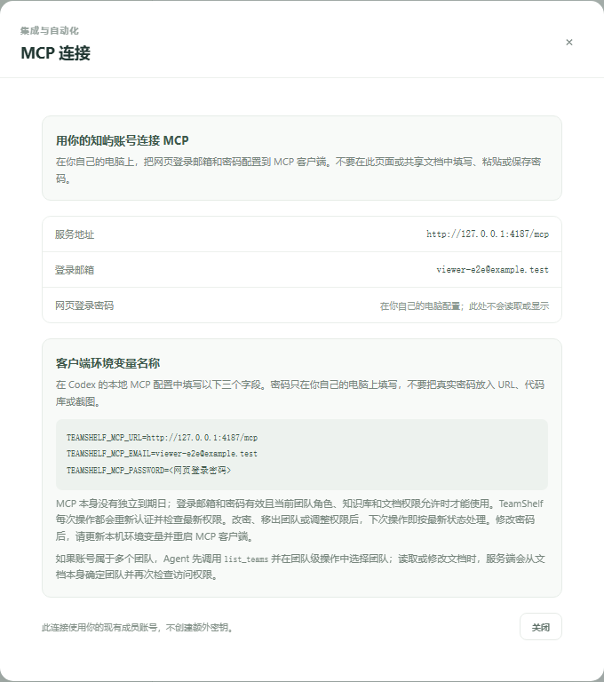
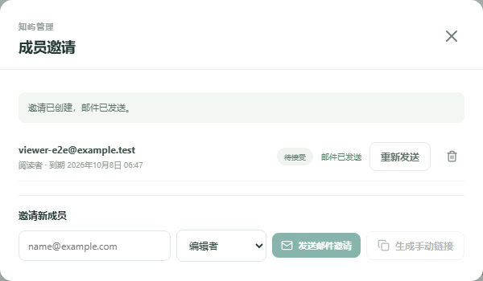
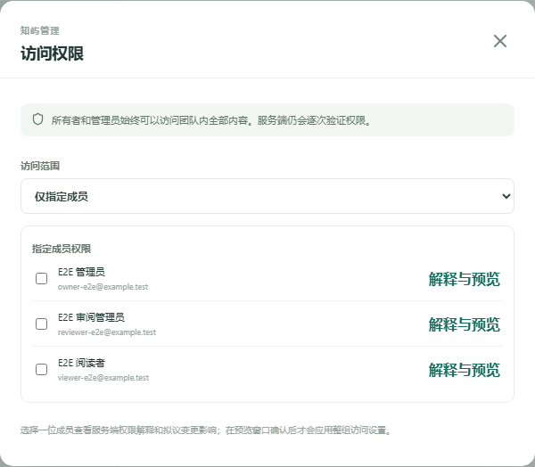

# 管理员：配置 MCP 与管理访问权限

MCP 使用成员现有的知屿账号，不签发额外 PAT、API key 或专用 Agent 账号。每次调用都重新验证登录邮箱、密码、团队成员角色和资源权限。MCP 本身没有独立到期日；登录邮箱和密码有效且当前权限允许时才能使用。密码改变、角色/ACL 调整或成员移除会在下次操作中按最新状态认证和授权。

## 部署与服务地址

确认 TeamShelf 已部署，并可从使用者 PC 访问。MCP 地址为可达的完整 HTTP(S) URL，路径以 `/mcp` 结尾，例如 `https://docs.example.net/mcp`。公开网络请使用有效 HTTPS，并让反向代理转发 `/mcp`。不要把 NAS 内部文件路径当成 URL，也不要让远程 PC 使用 `localhost`。部署与 TLS 说明见[部署指南](../DEPLOYMENT.md)。

每位成员登录后，打开侧栏的“MCP 连接”即可查看服务地址、当前登录邮箱和 Codex 配置字段名称。连接不要求管理员先为成员创建凭据。

以下界面截图来自隔离 E2E 测试团队，邮箱和文档内容均为虚构示例。

## 用角色和权限控制访问

MCP 沿用网页中的团队角色、知识库权限和文档 ACL。管理员在“团队成员”中邀请成员并分配合适的角色；管理员可以调整成员角色。团队成员管理能力仍由现有 owner/admin 规则决定。

知识库访问在知识库权限界面管理；文档访问在文档的“访问权限”界面管理。受限文档需有明确授权，并且成员还必须能访问所在知识库。授权不会绕过上级空间权限。MCP 会按每次调用时的当前数据判断访问；降低角色、撤销授权或移除成员后，不需要轮换密钥或通知用户重新登录 MCP。

将[PC 用户操作指南](PC-USER-GUIDE.md)发给需要连接 Codex 的成员。用户在本机填写自己的登录邮箱和网页登录密码；管理员不需要收集或转发成员密码。不要要求成员把密码发到邮件、工单、共享文档、截图或聊天中。

## 密码和权限变更

成员修改网页登录密码后，旧密码不再通过 MCP 认证。该成员需在自己的 PC 更新 `TEAMSHELF_MCP_PASSWORD` 并重启 MCP 子进程。密码修改不会产生新 token，也无需管理员撤销或重签凭据。

成员角色、空间访问或文档 ACL 改动无需更改 PC 配置；下一次 MCP 操作会用新的权限结果。团队级操作在多团队账号下需要 Agent 选择目标 `teamId`。资源操作使用资源标识定位所属团队并根据该资源 ACL 授权，客户端传入的团队值不能扩大权限。

如果先前配置了 `TEAMSHELF_MCP_TOKEN` 或旧 PAT，该认证方式已经停用。成员保留 `/mcp` URL，将本地配置替换为 `TEAMSHELF_MCP_EMAIL` 和 `TEAMSHELF_MCP_PASSWORD`，分别填自己的登录邮箱和网页登录密码。无需建立专用账号或新凭据；旧 PAT 不要再作为密码使用。

## 排错

| 现象 | 检查方法 |
| --- | --- |
| MCP 地址无法连接 | 检查 PC 可达的 HTTP(S) 主机名、`/mcp` 路径、防火墙、反向代理和证书；远程用户不能访问 NAS 的 localhost。 |
| 认证失败 | 让用户在自己的设备核对登录邮箱和最新网页登录密码；刚改密码时更新环境变量并重启 MCP 客户端。不要让用户把密码发给管理员排错。 |
| 返回 429 | 用户核对登录邮箱和密码后按 `Retry-After` 等待再试；避免连续反复启动客户端。 |
| 成员看不到团队/空间 | 检查该账号是否仍是团队成员、Agent 是否选择了正确团队，以及成员当前角色和空间 ACL。 |
| 可以列出工具但读写文档失败 | 检查目标空间权限、文档 ACL 和操作是否超出当前角色能力；MCP 只提供工具，服务端仍执行相同授权。 |
| 角色或 ACL 调整后结果仍旧 | 下一次调用即重新检查。确认调整针对登录邮箱对应的成员和目标资源；一般不需要改 PC 配置。 |

协议与工具边界见[Agent 与 MCP 参考](../MCP.md)。
