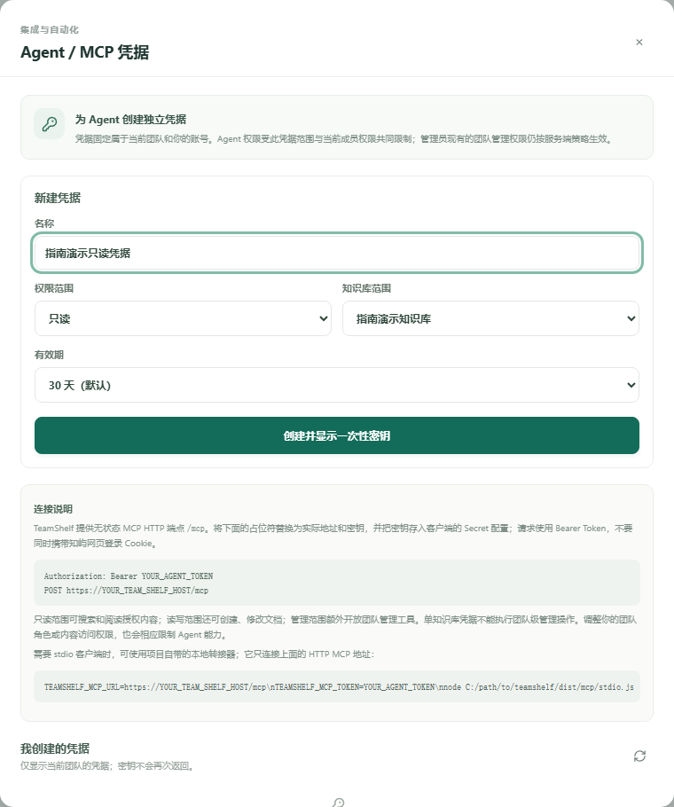
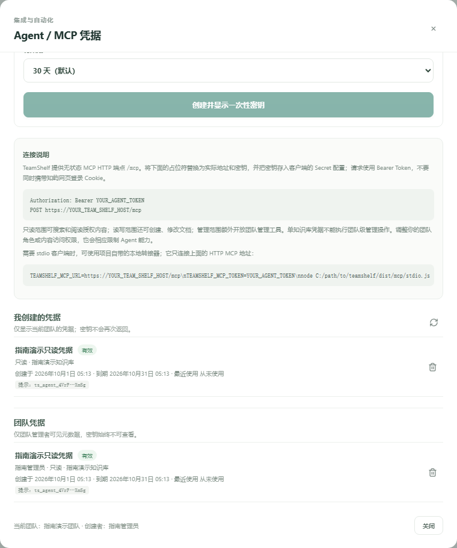

# 管理员：配置与管理 Agent / MCP 凭据

TeamShelf 的 MCP PAT 是成员自己的独立凭据。建议每位使用者登录后为自己创建最低权限 token；不要把管理员 PAT 分发给全体成员。Agent / MCP 使用用户现有的团队角色和知识库 ACL，不会绕过网页权限。

## 检查服务地址与访问权限

先确认 TeamShelf 服务已部署并可从使用者的电脑访问。客户端连接地址是服务主机的完整 HTTP(S) 地址并以 `/mcp` 结尾，例如 `https://docs.example.net/mcp`。公开网络部署应使用已配置好的 HTTPS；反向代理应原样转发 `/mcp`。详细部署和 TLS 步骤见[部署指南](../DEPLOYMENT.md)。不要把 NAS 内部文件路径当作 endpoint，也不要要求远程用户使用 `localhost`。

打开知屿左侧栏的“Agent / MCP”。所有已登录团队成员都可以进入并管理自己的凭据；owner 和 admin 额外能查看当前团队所有凭据的元数据。凭据列表不会显示完整 PAT。

## 成员创建凭据时的字段

| 页面字段 | 如何选择 | 权限效果 |
| --- | --- | --- |
| 名称 | 例如“文档只读助手”，避免放入秘密或个人敏感信息 | 便于在列表中辨认和撤销。 |
| 权限范围 | 默认“只读”；只在明确需要时选“读写”或“管理” | viewer 最多 read；editor 最多 write；owner/admin 最多 manage。 |
| 知识库范围 | 默认整个团队，或选择一个成员本来可读的知识库 | 指定空间后 token 只能访问该知识库；manage 也不能通过单空间 token 执行团队级管理操作。 |
| 有效期 | 默认 30 天；界面提供 7、30、90 天 | 服务端最长允许 90 天；到期后需重新创建。 |

scope 的权限是累进的：`read` 可读取，`write` 可读取并编辑文档，`manage` 还可进行管理操作。实际授权同时受 PAT scope、token 所属用户当前团队角色、资源 ACL，以及可选的单空间范围限制。空间必须是签发人当前可读的空间；服务端会在每次调用时重新检查成员和权限。

## 创建、保存和验证

1. 建议让成员使用自己的登录账号进入“Agent / MCP”，填入用途名称，选择最低 scope、必要时指定空间和期限，再创建凭据。
2. 创建成功后，完整 `ts_agent_…` token 只显示一次。成员应立即复制到本机密码管理器或受控 Secret 配置中；隐藏或关闭弹窗后，页面和团队凭据列表都不能再次取回明文。服务端只保存 token hash 和提示信息。
3. 将 endpoint `https://你的主机名/mcp` 与 PAT 安全提供给对应的客户端。PC 用户请转给[Codex 操作指南](PC-USER-GUIDE.md)；不要把 PAT 放在邮件、共享文档、工单、截图、URL、命令参数或代码库中。
4. 验证客户端连接后，先调用 `whoami` 和 `list_spaces` 确认身份、团队与可见范围，再按需做只读读取。不要用管理员 token 验证普通成员权限。

## 查看、轮换和撤销

所有成员都可以查看和撤销自己的凭据。owner 可以查看团队元数据并撤销任何成员的凭据；admin 可以查看团队元数据、撤销自己的凭据，以及撤销 editor/viewer 成员的凭据，但不能撤销其他 admin 或 owner 的凭据。普通成员看不到团队凭据列表。列表显示持有人、名称、scope、空间、到期、最近使用、token 提示和撤销状态，不显示完整 PAT。

若 token 泄漏或不再使用，立即从凭据列表撤销；服务端后续 MCP 请求会拒绝该 token。需要换新密钥时，创建新的最小权限凭据，安全更新客户端 Secret 并验证新凭据后，再撤销旧凭据。密码更改、成员离开团队、凭据过期、绑定空间删除或主动撤销都会令凭据失效；恢复旧备份也会撤销 PAT，防止旧状态重新启用令牌。

## 排错

| 现象 | 管理员可检查 |
| --- | --- |
| 页面中没有预期团队/空间 | 成员是否登录正确团队；成员角色和空间访问 ACL 是否符合预期。只有用户原本可读的空间能被绑定。 |
| 成员无法创建更高 scope | 检查当前角色上限：viewer=read，editor=write，owner/admin=manage。按其实际任务选择最低权限。 |
| 客户端返回 401 | token 是否过期、撤销、复制不完整，或 token 所属成员已改密码/离队；需要时签发新 token 并更新客户端。 |
| 客户端返回 403、列表缺少内容 | 检查 PAT scope、所属用户当前角色、单空间范围和资源 ACL 的交集。不要用扩大 token 权限代替修正访问 ACL。 |
| 连接返回 404、超时或 TLS 错误 | 确认 PC 可访问的 HTTP(S) 主机名、`/mcp` 路径、反向代理转发和证书；远程电脑不能使用 NAS 的 localhost。 |

TeamShelf 的 MCP 工具和协议边界见[Agent 与 MCP 参考](../MCP.md)。
