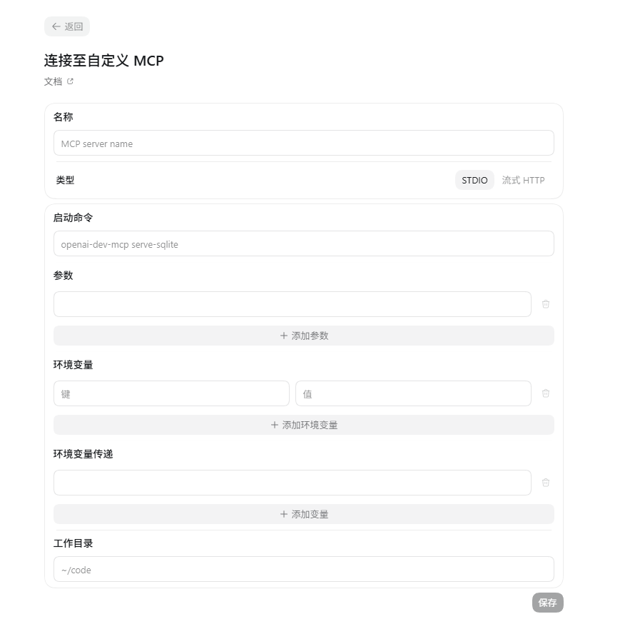

# PC 用户：用 Codex 连接 TeamShelf

本指南说明如何在自己的 Windows 电脑上配置 Codex。TeamShelf 服务可以运行在 NAS 或服务器；Codex 在 PC 上启动本机 STDIO 桥，再通过 `/mcp` 连接服务。新手推荐 STDIO 表单。

## 在 PC 准备桥接程序

安装 Node.js 24（版本范围 `>=24 <25`）和 Git。在 PowerShell 中于你选择的本机目录运行：

```powershell
git clone https://github.com/Zhao-zixi/team-docs.git
Set-Location team-docs
npm.cmd ci
npm.cmd run build:server
```

构建会生成 `dist/mcp/stdio.js`。后面填写的 Node、脚本参数和工作目录都必须是 PC 上的绝对路径。不要把 NAS 的 `/vol1/...` 文件路径填入 Codex。

## 在 Codex 表单填写连接



在 Codex 设置中新增自定义 MCP 服务器。字段按界面实际名称填写：

| 字段 | 填写内容 | 说明 |
| --- | --- | --- |
| 名称 | `teamshelf` | Codex 中显示的本地服务器名称。 |
| 类型 | `STDIO` | 选择标准输入/输出服务器。TeamShelf 也提供 Streamable HTTP `/mcp`，但本指南按截图中的 STDIO 表单配置。 |
| 启动命令 | PC 上 `node.exe` 的完整路径，例如 `C:\Program Files\nodejs\node.exe` | PowerShell 命令 `(Get-Command node).Source` 可显示该路径。 |
| 参数 | PC 项目的 `dist\mcp\stdio.js` 完整路径，例如 `C:\Users\you\team-docs\dist\mcp\stdio.js` | 在项目根目录运行 `(Resolve-Path .\dist\mcp\stdio.js).Path` 获取。整条路径作为一个参数，不加 shell 引号。 |
| 环境变量 | `TEAMSHELF_MCP_URL`、`TEAMSHELF_MCP_EMAIL`、`TEAMSHELF_MCP_PASSWORD` | 分别填服务地址、你的知屿登录邮箱和网页登录密码。密码只在自己的 PC 上填写。 |
| 环境变量传递 | 留空 | 本指南在上方显式填写名称和值，不需要透传 Codex 进程已有环境变量。不要填写秘密值作为透传名称。 |
| 工作目录 | PC 上项目根目录，例如 `C:\Users\you\team-docs` | PowerShell 命令 `(Resolve-Path .).Path` 可显示。不是 `dist` 子目录，也不是 NAS 文件路径。 |

三个环境变量示例：

```text
TEAMSHELF_MCP_URL=https://你的NAS可达主机名/mcp
TEAMSHELF_MCP_EMAIL=你的知屿登录邮箱
TEAMSHELF_MCP_PASSWORD=你的知屿网页登录密码
```

地址必须是 Codex 所在 PC 可访问的完整 HTTP(S) 地址并以 `/mcp` 结尾。远程连接 NAS 时不要填 `localhost` 或 `127.0.0.1`，它们指向 PC 自己。跨网连接应使用有效 HTTPS。环境变量会传给 MCP 子进程；请只在可信个人电脑上配置密码，不要把真实密码写进项目文件、命令、截图、共享文档或日志。此配置说明不代表 Codex 对环境变量作了加密存储承诺。

Codex 各版本的表单名称可能变化。STDIO 启动命令、参数、环境变量、环境变量传递和工作目录按实际界面填写；不要根据其他客户端示例虚构 HTTP 表单字段。字段语义可查阅 [Codex MCP 文档](https://learn.chatgpt.com/docs/extend/mcp?surface=cli)和[配置参考](https://learn.chatgpt.com/docs/config-file/config-reference)。

## 保存并检查连接

保存后按 Codex 提示重启或刷新 MCP 连接。让 Agent 调用 `whoami`、`list_teams` 和 `list_spaces`，确认登录账号、团队和可访问知识库；读取文档可用 `list_documents` 或 `get_document`。如果你加入多个团队，Agent 应先列出团队，并在团队级操作中选择目标团队。

TeamShelf 每次操作都会用网页登录邮箱和密码重新认证，并实时检查当前成员角色、空间和文档 ACL。MCP 本身没有独立到期日；登录邮箱和密码有效且当前权限允许时才能使用。改密、移出团队或调整文档访问后，下次操作立即按新状态处理；权限改变不用重新配置客户端。**如果网页登录密码改变**，请在本机更新 `TEAMSHELF_MCP_PASSWORD` 并重启 Codex MCP 进程。

## 从旧 PAT 配置迁移

旧 `TEAMSHELF_MCP_TOKEN` / PAT 认证已停用。打开 Codex 的 `teamshelf` 配置，保留正确的 `TEAMSHELF_MCP_URL`，把 `TEAMSHELF_MCP_TOKEN` 替换成 `TEAMSHELF_MCP_EMAIL` 和 `TEAMSHELF_MCP_PASSWORD` 两项，并分别填写你的知屿网页登录邮箱和密码。无需创建专用账号、MCP 凭据或其他密钥。保存后重启/刷新连接，并调用 `whoami` 验证；不要把旧 token 当作密码使用。

## 常见问题

| 现象 | 检查方法 |
| --- | --- |
| MCP 进程无法启动或找不到文件 | 确认 Node.js 24；启动命令是 PC 的 `node.exe` 绝对路径；参数指向已生成的 `dist\mcp\stdio.js`；工作目录是 PC 项目根目录。 |
| 连接超时、DNS 或 TLS 错误 | 确认 PC 可访问 NAS 地址和端口，证书受信任，反向代理转发 `/mcp`。远程 NAS 不能用 PC 的 localhost。 |
| 404 或 endpoint 无效 | `TEAMSHELF_MCP_URL` 应为完整 HTTP(S) 地址并以 `/mcp` 结尾，不要填网页登录首页。 |
| 认证失败 | 检查登录邮箱、网页登录密码和完整 `/mcp` 地址；密码刚改过时更新本机环境变量并重启 MCP 进程。 |
| 返回 429 | 检查邮箱和密码，按响应中的 `Retry-After` 等待后重试；不要连续反复保存或启动。 |
| 工具显示无权查看或修改 | 检查账号是否仍在目标团队、当前成员角色、知识库权限和文档 ACL。修正网页权限后重试；客户端不需要重配。 |
| 看不到预期团队或文档 | 调用 `list_teams` 选择正确团队；确认当前账号仍是该团队成员且拥有对应空间/文档权限。 |
